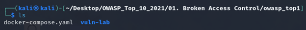

# 🛡️ Broken Access Control

---

## Cài đặt môi trường Docker

Đầu tiên hãy tải các challenge về bằng cách `git clone`:

```bash
git clone https://github.com/Forgebreaker/OWASP_Top_10_2021.git
```

Chạy Docker (Lưu ý: chỏ đến địa chỉ có file `.yaml` để chạy docker):

```bash
docker compose up -d
```

Sau khi chạy docker, ta sẽ vào bài lab tại địa chỉ:

```
http://127.0.0.1:1001
```

---

## Phân tích

- Vào **View Page Source** để xem có thể khai thác được thông tin gì không?
- Thu thập được tài khoản và mật khẩu:

```
guest / guest
```

→ Dùng để đăng nhập vào hệ thống.

---

## Phân tích code

- Sau khi đăng nhập ở trang `index.php`, dữ liệu được lấy từ file `database.sql` và kiểm tra tại bảng `users`, truy vấn theo cột `account_number`.
- Nếu đăng nhập thành công sẽ chuyển đến trang:

```
account.php?account_number=
```

---

## Kiểm tra file database.sql

Truy cập trực tiếp vào:

```
http://127.0.0.1:1001/account.php?account_number=8073
```
